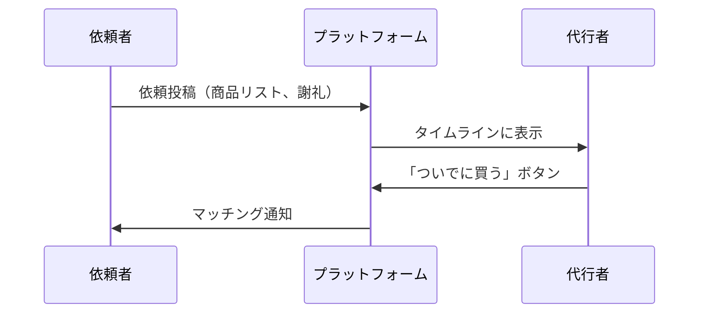
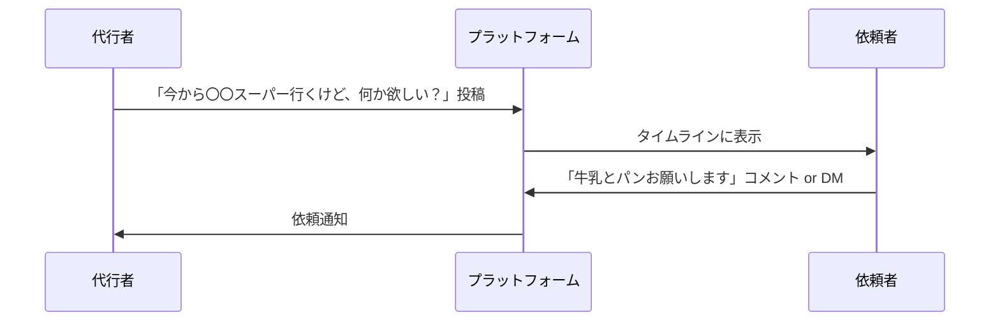
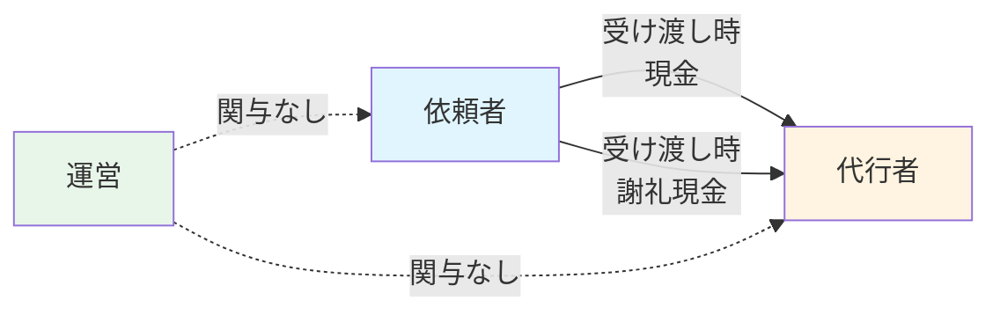
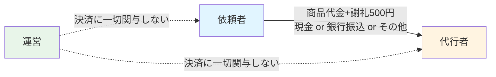
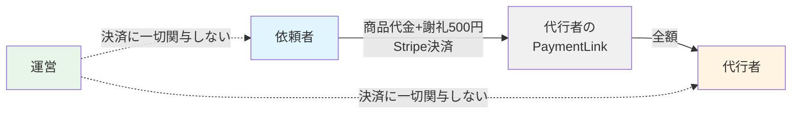
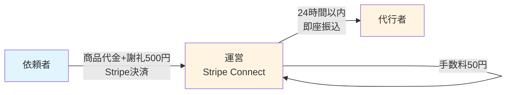
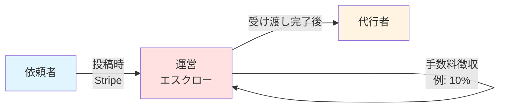
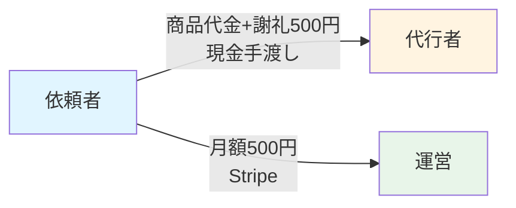
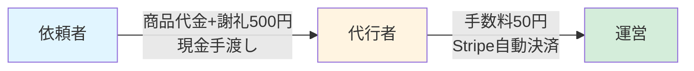
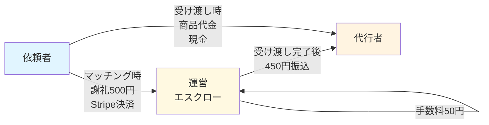

# ビジネスフロー詳細

**目的**: Kotokuプラットフォームのビジネスフロー（ビジネス観点）を可視化し、法的論点を明確化

**最終更新**: 2025-10-20

**重要な発見**:
- メルカリは2013年創業〜2017年まで資金移動業登録なしでエスクロー運営（売上金1年保管）
- 2017年に金融庁から指摘を受け、90日保管＋ポイント制度に変更
- **代行者から手数料徴収する方式（ランサーズ型）が最も有望**

---

## 📊 投稿者パターン別フロー

### パターンA: 依頼者のみが投稿



**メリット**: ニーズが明確、商品リストが事前確定
**デメリット**: 代行者が見つからない可能性、依頼者の心理的ハードル

---

### パターンB: 代行者のみが投稿



**メリット**: 依頼者の心理的ハードル低い、マッチング率が高い
**デメリット**: 商品リストが事前に決まっていない、チャットのやり取りが増える

---

### パターンC: 両方OK

**特徴**: パターンAとパターンBの両方が可能
**メリット**: ユーザーの選択肢が広がる、マッチング率が最大化
**デメリット**: UIが複雑、法的論点が増える

---

## 💰 資金の流れパターン（全パターン網羅）

### パターン1: 現金手渡し × 現金手渡し



**資金の流れ**:
1. 商品代金: 依頼者 → 代行者（現金手渡し）
2. 謝礼: 依頼者 → 代行者（現金手渡し）
3. 運営: 関与なし

**資金移動法リスク**: 極めて低（運営が一切関与しない）
**税務管理**: 困難（運営は支払いを把握できない）
**法的論点**: 運営は支払調書を提出できない

---

### パターン2: 当事者間で自由に決済（運営関与なし）



**資金の流れ**:
1. 商品代金+謝礼: 依頼者 → 代行者（当事者間で自由に決定）
2. 運営: 決済に一切関与しない

**資金移動法リスク**: 極めて低（運営が一切関与しない）
**メリット**: ユーザーの選択肢が広がる、法的リスクが低い
**デメリット**: トラブル時に運営が介入できない、税務管理が困難

**⚠️ 注意**: PayPay・LINE Payは営利目的の個人間送金を禁止しているため、代行者が謝礼を受け取ることは規約違反の可能性

---

### パターン3: 代行者がPaymentLink発行（技術的に可能だが非推奨）



**資金の流れ**:
1. 代行者が自分のStripeアカウントでPaymentLink発行
2. 依頼者がPaymentLinkで決済
3. 運営は関与しない

**資金移動法リスク**: 極めて低（運営が一切関与しない）
**メリット**: キャッシュレス、法的リスクが低い
**デメリット**: 代行者がStripeアカウント登録必要、実装が複雑、トラブル時の対応困難

**⚠️ 技術的誤り訂正**: 以前のパターン2-4で「運営がPaymentLink生成」と記載していましたが、Stripe PaymentLinkは自分のアカウントでしか発行できないため、運営が代行者のためにPaymentLinkを発行することは技術的に不可能です（Stripe Connect必須）。

---

### パターン4: Stripe Connect即座振込（要登録検討）



**資金の流れ**:
1. 依頼者 → Stripe Connect → 運営（一瞬通過）
2. 運営 → 代行者（24時間以内に即座振込）
3. 運営: 手数料を徴収

**資金移動法リスク**: 中〜高（「即座」の定義が曖昧、弁護士確認必須）
**メリット**: UXが良い、手数料徴収可能
**デメリット**: 資金移動業に該当する可能性、実装が複雑

---

### パターン5: エスクロー型（運営が資金を預かる）



**資金の流れ**:
1. 商品代金+謝礼: 依頼者 → 運営（一時預かり）
2. 受け渡し完了後: 運営 → 代行者（手数料を差し引いた額）
3. 運営: 手数料を徴収

**資金移動法リスク**: **高（ほぼ確実に該当）**
**必要な対応**: 第二種 or 第三種資金移動業の登録（費用1,000万円〜、期間1〜2年）
**メリット**: UX最高、税務管理可能、トラブル時の対応容易
**デメリット**: 登録が必須、運営の責任拡大、実装コスト高

**⚠️ メルカリの事例**:
- 2013年創業〜2017年: 登録なしでエスクロー運営（売上金1年保管）
- 2017年: 金融庁から指摘を受け、90日保管＋ポイント制度に変更
- 2019年: メルペイとして資金移動業登録（第二種、登録番号57号）
- **「90日以内なら合法」という法的根拠はない**（金融庁との交渉結果）

---

### パターン6: 月額課金（プラットフォーム利用料）



**資金の流れ**:
1. 商品代金+謝礼: 依頼者 → 代行者（現金手渡し）
2. 月額利用料: 依頼者 → 運営（別途）

**資金移動法リスク**: 極めて低（プラットフォーム利用料なので該当しない）
**メリット**: 安定収益、法的リスクが低い
**デメリット**: ユーザーが払いたがらない可能性

---

### 🎯 パターン7: 代行者から手数料徴収（ランサーズ方式）✅ MVP期推奨



**資金の流れ**:
1. 商品代金+謝礼: 依頼者 → 代行者（現金手渡し）
2. 受け渡し完了時: 代行者 → 運営に手数料50円（謝礼の10%）をStripe自動決済

**資金移動法リスク**: **極めて低（ほぼ確実に該当しない）**
**実例**: ランサーズ（16.5%）、クラウドワークス（20%）が同じスキーム
**メリット**:
- MVP期から収益化可能
- 資金移動業登録不要
- 実装が簡単（現金手渡しのまま）
- トラブル対応がシンプル（決済前キャンセル可）
- 運営の負担が軽い（C2C向き）

**デメリット**:
- 依頼者が現金500円を用意する必要（キャッシュレス派に不便）
- 税務管理やや困難（現金謝礼を運営が把握できない）
- 代行者の心理的抵抗の可能性

**実装方法**:
1. 代行者登録時にクレカ登録必須
2. 受け渡し完了ボタン押下時に自動決済
3. 利用規約で明記: 「代行者は謝礼の10%をプラットフォーム利用料として運営に支払う」

**⚠️ 重要**: このパターンでは、運営は依頼者・代行者間の決済に一切関与しないため、資金移動業に該当しません。手数料は「プラットフォーム利用料」です。

---

### 🔮 パターン8: 二段階決済・完全分離モデル（将来検討）⚠️ 要登録



**資金の流れ**:
1. マッチング時: 依頼者 → 運営に謝礼500円支払い（Stripe決済）
2. 運営が資金を一時保管（エスクロー）
3. 代行者が買い物実施
4. 受け渡し時: 依頼者 → 代行者に商品代金を現金支払い
5. 受け渡し完了後: 運営 → 代行者に450円振込（手数料50円差し引き）

**資金移動法リスク**: **高（資金移動業該当の可能性大）**
- 運営が謝礼を「一時保管」する時点でエスクロー決済に該当
- メルカリが2017年に金融庁から指摘を受けたのと同じ構造
- **第三種資金移動業（5万円以下）の登録が必要**

**メリット**:
- ✅ **UX最高**: 依頼者は謝礼をキャッシュレス決済（現代的）
- ✅ **税務管理容易**: 運営が全額把握→支払調書発行可能
- ✅ **競合優位性**: Uber Eats、メルカリ型の現代的体験
- ✅ **代行者に優しい**: 謝礼が確実にもらえる（依頼者が現金を忘れるリスクなし）

**デメリット**:
- ❌ **資金移動業登録必須**: 費用1,000万円〜、期間1〜2年
- ❌ **MVP期には不向き**: 登録なしで開始するとメルカリと同じリスク
- ⚠️ **トラブル対応が複雑**: 返金判定、キャンセル処理が必要
- ⚠️ **実装コスト高**: Stripe Connect、エスクロー管理

**想定される使用フェーズ**:
- フェーズ1（MVP期）: パターン7で開始
- フェーズ2（成長期）: 資金移動業登録を検討・準備
- フェーズ3（スケール期）: 登録完了後、パターン8に移行

**⚠️ 重要**: このパターンは法的に優れたUXを実現できますが、資金移動業登録なしでは実装できません。登録なしで開始するとメルカリと同じく金融庁から指摘を受けるリスクがあります。

---

## 💰 資金の流れパターン比較表

| パターン | 決済方法 | 運営の関与 | 資金移動法<br/>リスク | 税務管理 | 収益化 | UX | MVP期推奨 | 将来性 |
|----------|----------|------------|---------------------|----------|--------|-----|----------|--------|
| 1 | 現金手渡し | なし | 極めて低 | 困難 | 不可 | △ | ⚠️ | ⚠️ |
| 2 | 当事者間で自由 | なし | 極めて低 | 困難 | 不可 | ○ | ⚠️ | ⚠️ |
| 3 | 代行者PaymentLink | なし | 極めて低 | 困難 | 不可 | △ | ❌ | ❌ |
| 4 | Connect即座振込 | 即座振込 | 中〜高 | 可能 | 可能 | ◎ | ❌ | ⚠️ |
| 5 | エスクロー | 資金保管 | **高** | 可能 | 可能 | ◎ | ❌ | ◎ |
| 6 | 月額課金 | なし | 極めて低 | N/A | 可能 | ○ | ✅ | △ |
| **7** | **現金+代行者手数料** | **手数料のみ** | **極めて低** | **やや困難** | **可能** | **△** | **✅✅** | **△** |
| **8** | **事前決済+エスクロー** | **資金保管** | **高** | **◎** | **可能** | **◎** | **❌** | **✅✅** |

**凡例**:
- ✅✅ 最推奨 / ◎ 優秀
- ✅ 推奨 / ○ 良好
- ⚠️ 条件付き推奨 / △ やや課題あり
- ❌ 非推奨

**推奨戦略**:
- **MVP期（〜6ヶ月）**: パターン7で開始（法的安全、即座開始可能）
- **成長期（6ヶ月〜2年）**: 資金移動業登録を検討・準備（第三種、5万円以下）
- **スケール期（2年〜）**: パターン8に移行（UX改善、競合優位性確保）

---

## 🔍 弁護士への質問（資金の流れ関連）

### Q1. パターン7（代行者から手数料徴収）の合法性 🔴 最優先

**スキーム**:
```
1. 依頼者 → 代行者に商品代金+謝礼500円（現金手渡し）
2. 受け渡し完了時: 代行者 → 運営に手数料50円（謝礼の10%）をStripe自動決済
```

**質問**:
1. このスキームは資金移動法に該当しますか？
2. ランサーズ・クラウドワークスと同じモデルと理解して良いですか？
3. 最低賃金法の適用はありますか？
4. 手数料率の上限規制はありますか？（ランサーズ16.5%、クラウドワークス20%）
5. 利用規約に明記すべき事項を教えてください。

---

### Q2. メルカリのエスクロー事例について

**質問**:
1. メルカリは2013年〜2017年に資金移動業登録なしでエスクロー運営していましたが、これは違法でしたか？
2. 2017年に金融庁から指摘を受けて変更した内容（90日保管＋ポイント制度）は、資金移動法該当を回避できていますか？
3. 「保管期間を90日以内にすればエスクロー型でも資金移動業登録不要」という法的根拠はありますか？
4. 「即座払い」エスクロー（受け渡し完了と同時に代行者に振込）なら資金移動業に該当しませんか？その場合の「即座」の定義は？

---

### Q3. 資金移動業登録の現実性

**質問**:
1. 第三種資金移動業（5万円以下）の登録要件と費用・期間を教えてください。
2. スタートアップが資金移動業登録するのは現実的ですか？
3. MVP期に登録なしで開始し、β版以降に登録する戦略は合理的ですか？

---

### Q4. パターン8（二段階決済モデル）の法的評価 🟡 重要

**スキーム**:
```
1. マッチング時: 依頼者→運営に謝礼500円支払い（Stripe決済）
2. 運営が資金を一時保管（エスクロー）
3. 受け渡し完了後: 運営→代行者に450円振込（手数料50円差し引き）
4. 商品代金は別途、依頼者→代行者に現金支払い（運営関与なし）
```

**質問**:
1. このスキームは資金移動業に該当しますか？（パターン5と同じ評価でしょうか？）
2. 「受け渡し完了後すぐ振込」でも、一時保管している時点で資金移動業該当と見なされますか？
3. 資金移動業登録後にこのスキームを採用することは可能ですか？
4. パターン7（現金手渡し）からパターン8（事前決済）へ移行する際の法的注意点はありますか？
5. パターン8のUX優位性（キャッシュレス、税務管理容易）は、登録コストに見合うと思いますか？

---

### Q5. 車を使用した買い物代行と運送業法 🔴 最優先（新発見）

#### Kotokuの価値提案と車の必要性

**Kotokuのターゲット**: 地方都市の車依存問題を抱える人々
- **依頼者**: 車がない（または免許がない）ため買い物に行けない
- **代行者**: 車を持っており、「ついで」に買い物を代行できる

**地方都市の現実**:

| 地域タイプ | スーパーまでの距離 | 自転車での所要時間 | 現実的か？ |
|-----------|-----------------|-----------------|----------|
| 都市部（甲府市中心） | 2-3km | 10-15分 | ✅ 可能 |
| 地方都市郊外 | 5-10km | 30-60分 | ❌ 非現実的 |
| **地方都市（車依存型）** | **10km以上** | **1時間以上** | **❌ 不可能** |

**根本的なジレンマ**:
- **自転車・徒歩のみに限定** = 運送業法回避可能 **だが** 地方都市の車依存問題を解決できない（サービスの価値提案が崩壊）
- **車の使用を許可** = 地方都市の車依存問題を解決できる **だが** 運送業法該当の可能性

**結論**: Kotokuの価値提案を実現するには**車の使用が不可避**です。運送業法と真正面から向き合う必要があります。

#### スキーム

```
1. 依頼者が「牛乳とパンを買ってほしい」と依頼
2. 代行者が車でスーパーに行く（10km先）
3. 代行者が商品を購入
4. 代行者が車で依頼者の自宅まで運ぶ
5. 依頼者が謝礼500円を支払う
```

**法的論点**:
貨物自動車運送事業法では「他人の需要に応じ、有償で、自動車を使用して貨物を運送する事業」には国土交通大臣の許可が必要です。

本スキームが該当する可能性:
- ✅ 他人の需要に応じ（依頼者の需要）
- ✅ 有償（謝礼500円）
- ✅ 自動車を使用して（車で運ぶ）
- ✅ 貨物を運送（商品を運ぶ）

**質問**:
1. **該当性の判断**: このスキームは貨物自動車運送事業法に該当しますか？
2. **「買い物代行」の解釈**: 主たる役務は商品の「購入」であり、運送は付随的行為という主張は認められますか？
3. **「ついで」の解釈**: 代行者が「自分の買い物のついで」に他人の分も買う場合、「業としての運送」に該当しないと主張できますか？
4. **「業として」の解釈**: たまに1-2回なら「事業」に該当しない可能性はありますか？反復継続の基準は？
5. **軽貨物運送業の届出**: 該当する場合、代行者は軽貨物運送業の届出が必要ですか？（Uber Eatsは配達員に届出を要求）
6. **Uber Eatsとの違い**: Uber Eatsは配達専業、Kotokuは「ついで」という違いは法的に意味がありますか？
7. **徒歩・自転車限定**: 車の使用を禁止し、徒歩・自転車のみに制限すべきですか？（地方都市では現実的でないが）
8. **受け渡し場所の工夫**: 受け渡しをスーパー駐車場に限定し、自宅までの運送は依頼者自身が行う形にすれば回避できますか？
9. **少量・少額の特例**: 少量（5kg以下）・少額（謝礼月5万円以下）の「ついで運送」に特例措置の可能性はありますか？
10. **グレーゾーン運営のリスク**: 「ついで」「購入代行」を明記した利用規約で開始した場合、国土交通省から指摘を受けるリスクはどの程度ですか？

**⚠️ 重要**: この論点が「違法」と判断された場合、パターン7でもパターン8でもサービス全体が成立しなくなる可能性があります。資金移動業法以上に重大な論点です。

**代替案の検討**:
もし運送業法に該当すると判断された場合、以下の対応が必要:
1. 徒歩・自転車限定（地方都市では非現実的）
2. 代行者に軽貨物運送業の届出を要求（ハードルが高すぎる）
3. 規制改革・ロビー活動（詳細は regulatory-strategy.md 参照）

---

## 次ステップ

このビジネスフローを弁護士に提示し、以下の点を確認:

1. **資金の流れパターン**: パターン1〜6のうち、資金移動法の適用を受けるのはどれか
2. **投稿者パターン**: 依頼者のみ / 代行者のみ / 両方OKのうち、法的リスクが低いのはどれか
3. **推奨されるビジネスモデル**: MVP期とβ版以降で推奨される組み合わせ
4. **トラブル時の責任範囲**: 運営がどこまで関与すべきか

---

**関連ドキュメント**:
- [business-model-options.md](./business-model-options.md) - ビジネスモデルの選択肢分析
- [operational-patterns.md](./operational-patterns.md) - アプリ運用の建て付けパターン
- [legal-qa-for-lawyer.md](./legal-qa-for-lawyer.md) - 弁護士への質問リスト
